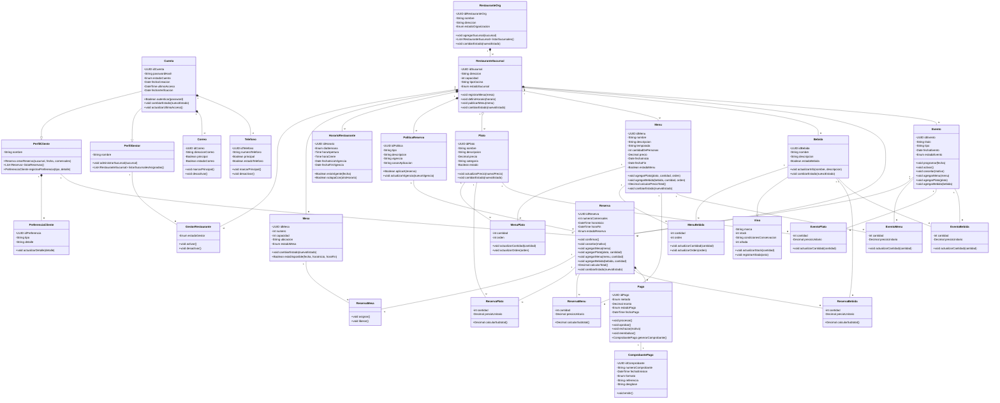

```mermaid
classDiagram
    %% ============================
    %% CUENTAS Y PERFILES
    %% ============================
    class Cuenta {
        -UUID idCuenta
        -String passwordHash
        -Enum estadoCuenta
        -Date fechaCreacion
        -DateTime ultimoAcceso
        -Date fechaVerificacion
        +Boolean autenticar(password)
        +void cambiarEstado(nuevoEstado)
        +void actualizarUltimoAcceso()
    }

    class PerfilCliente {
        -String nombre
        +Reserva crearReserva(sucursal, fecha, comensales)
        +List~Reserva~ listarReservas()
        +PreferenciaCliente registrarPreferencia(tipo, detalle)
    }

    class PerfilGestor {
        -String nombre
        +void administrarSucursal(sucursal)
        +List~RestauranteSucursal~ listarSucursalesAsignadas()
    }

    class GestorRestaurante {
        -Enum estadoGestor
        +void activar()
        +void desactivar()
    }

    class PreferenciaCliente {
        -UUID idPreferencia
        -String tipo
        -String detalle
        +void actualizarDetalle(detalle)
    }

    class Correo {
        -UUID idCorreo
        -String direccionCorreo
        -Boolean principal
        -Boolean estadoCorreo
        +void marcarPrincipal()
        +void desactivar()
    }

    class Telefono {
        -UUID idTelefono
        -String numeroTelefono
        -Boolean principal
        -Boolean estadoTelefono
        +void marcarPrincipal()
        +void desactivar()
    }

    Cuenta --|> PerfilCliente
    Cuenta --|> PerfilGestor
    Cuenta "1" *-- "M" Correo
    Cuenta "1" *-- "M" Telefono
    PerfilCliente "1" *-- "M" PreferenciaCliente
    PerfilGestor "1" -- "M" GestorRestaurante


    %% ============================
    %% ORGANIZACIÓN Y SUCURSALES
    %% ============================
    class RestauranteOrg {
        -UUID idRestauranteOrg
        -String nombre
        -String direccion
        -Enum estadoOrganizacion
        +void agregarSucursal(sucursal)
        +List~RestauranteSucursal~ listarSucursales()
        +void cambiarEstado(nuevoEstado)
    }

    class RestauranteSucursal {
        -UUID idSucursal
        -String direccion
        -int capacidad
        -String tipoCocina
        -Enum estadoSucursal
        +void registrarMesa(mesa)
        +void definirHorario(horario)
        +void publicarMenu(menu)
        +void cambiarEstado(nuevoEstado)
    }

    class Mesa {
        -UUID idMesa
        -int numero
        -int capacidad
        -String ubicacion
        -Enum estadoMesa
        +void cambiarEstado(nuevoEstado)
        +Boolean estaDisponible(fecha, horaInicio, horaFin)
    }

    class HorarioRestaurante {
        -UUID idHorario
        -Enum diaSemana
        -Time horaApertura
        -Time horaCierre
        -Date fechaInicioVigencia
        -Date fechaFinVigencia
        +Boolean estaVigente(fecha)
        +Boolean solapaCon(otroHorario)
    }

    class PoliticaReserva {
        -UUID idPolitica
        -String tipo
        -String descripcion
        -String vigencia
        -String casosAplicacion
        +Boolean aplicaA(reserva)
        +void actualizarVigencia(nuevaVigencia)
    }

    RestauranteOrg "1" *-- "M" RestauranteSucursal
    RestauranteSucursal "1" -- "M" GestorRestaurante
    RestauranteSucursal "1" *-- "M" Mesa
    RestauranteSucursal "1" *-- "M" HorarioRestaurante
    RestauranteSucursal "1" *-- "M" PoliticaReserva


    %% ============================
    %% MENÚ: PLATOS Y BEBIDAS
    %% ============================
    class Menu {
        -UUID idMenu
        -String nombre
        -String descripcion
        -String temporada
        -int cantidadDePersonas
        -Decimal precio
        -Date fechaInicio
        -Date fechaFin
        -Boolean estadoMenu
        +void agregarPlato(plato, cantidad, orden)
        +void agregarBebida(bebida, cantidad, orden)
        +Decimal calcularPrecioTotal()
        +void cambiarEstado(nuevoEstado)
    }

    class Plato {
        -UUID idPlato
        -String nombre
        -String descripcion
        -Decimal precio
        -String categoria
        -Boolean estado
        +void actualizarPrecio(nuevoPrecio)
        +void cambiarEstado(nuevoEstado)
    }

    class MenuPlato {
        -int cantidad
        -int orden
        +void actualizarCantidad(cantidad)
        +void actualizarOrden(orden)
    }

    class Bebida {
        -UUID idBebida
        -String nombre
        -String descripcion
        -Boolean estadoBebida
        +void actualizarInfo(nombre, descripcion)
        +void cambiarEstado(nuevoEstado)
    }

    class Vino {
        -String marca
        -int stock
        -String condicionesConservacion
        -int añada
        +void actualizarStock(cantidad)
        +void registrarAñada(anio)
    }

    class MenuBebida {
        -int cantidad
        -int orden
        +void actualizarCantidad(cantidad)
        +void actualizarOrden(orden)
    }

    RestauranteSucursal "1" o-- "M" Plato
    RestauranteSucursal "1" o-- "M" Menu
    RestauranteSucursal "1" o-- "M" Bebida
    Menu "1" -- "M" MenuPlato
    Plato "1" -- "M" MenuPlato
    Menu "1" -- "M" MenuBebida
    Bebida "1" -- "M" MenuBebida
    Bebida --|> Vino


    %% ============================
    %% RESERVAS Y CONSUMOS
    %% ============================
    class Reserva {
        -UUID idReserva
        -int numeroComensales
        -DateTime horaInicio
        -DateTime horaFin
        -Enum estadoReserva
        +void confirmar()
        +void cancelar(motivo)
        +void agregarMesa(mesa)
        +void agregarPlato(plato, cantidad)
        +void agregarMenu(menu, cantidad)
        +void agregarBebida(bebida, cantidad)
        +Decimal calcularTotal()
        +void cambiarEstado(nuevoEstado)
    }

    class ReservaMesa {
        +void asignar()
        +void liberar()
    }

    class ReservaPlato {
        -int cantidad
        -Decimal precioUnitario
        +Decimal calcularSubtotal()
    }

    class ReservaMenu {
        -int cantidad
        -Decimal precioUnitario
        +Decimal calcularSubtotal()
    }

    class ReservaBebida {
        -int cantidad
        -Decimal precioUnitario
        +Decimal calcularSubtotal()
    }

    PerfilCliente "1" -- "M" Reserva
    RestauranteSucursal "1" -- "M" Reserva
    PoliticaReserva "1" -- "M" Reserva
    Mesa "1" -- "M" ReservaMesa
    Reserva "1" -- "M" ReservaMesa
    Plato "1" -- "M" ReservaPlato
    Reserva "1" -- "M" ReservaPlato
    Menu "1" -- "M" ReservaMenu
    Reserva "1" -- "M" ReservaMenu
    Bebida "1" -- "M" ReservaBebida
    Reserva "1" -- "M" ReservaBebida


    %% ============================
    %% EVENTOS Y CONSUMOS
    %% ============================
    class Evento {
        -UUID idEvento
        -String titulo
        -String tipo
        -Date fechaEvento
        -Enum estadoEvento
        +void programar(fecha)
        +void activar()
        +void cancelar(motivo)
        +void agregarMenu(menu)
        +void agregarPlato(plato)
        +void agregarBebida(bebida)
    }

    class EventoMenu {
        -int cantidad
        -Decimal precioUnitario
        +void actualizarCantidad(cantidad)
    }

    class EventoPlato {
        -int cantidad
        -Decimal precioUnitario
        +void actualizarCantidad(cantidad)
    }

    class EventoBebida {
        -int cantidad
        -Decimal precioUnitario
        +void actualizarCantidad(cantidad)
    }

    RestauranteSucursal "1" *-- "M" Evento
    Evento "1" -- "M" Reserva
    Menu "1" -- "M" EventoMenu
    Evento "1" -- "M" EventoMenu
    Plato "1" -- "M" EventoPlato
    Evento "1" -- "M" EventoPlato
    Bebida "1" -- "M" EventoBebida
    Evento "1" -- "M" EventoBebida


    %% ============================
    %% PAGOS
    %% ============================
    class Pago {
        -UUID idPago
        -Enum metodo
        -Decimal monto
        -Enum estadoPago
        -DateTime fechaPago
        +void procesar()
        +void aprobar()
        +void rechazar(motivo)
        +void reembolsar()
        +ComprobantePago generarComprobante()
    }

    class ComprobantePago {
        -UUID idComprobante
        -String numeroComprobante
        -DateTime fechaEmision
        -Enum formato
        -String referencia
        -String desglose
        +void emitir()
    }

    Reserva "1" *-- "M" Pago
    Pago "1" -- "1" ComprobantePago
```
